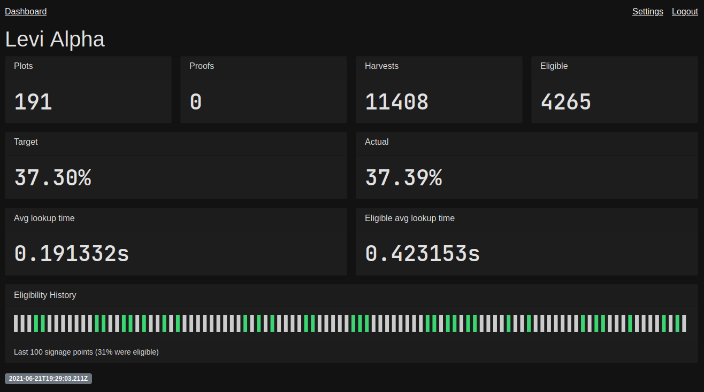

# Plot Tracker

[](https://github.com/levidurfee/plot-tracker/actions/workflows/codeql-analysis.yml)



1. Create a [plot-tracker.app][1] account.
1. Create a new **API Key**
1. Create a new **Farm Key**
1. Create your `config.yml`
1. Update `log_file`
1. Update `api_key`
1. Update `farm_key`

I've done my best to keep the code simple and easy to understand. It's all in
the [main.go][2] file.

## Example Config

```yaml
log_file: "/home/CHANGE_ME/.chia/mainnet/log/debug.log"
api_key: "1234"
farm_key: "56789"
```

## Screenshot


[1]: https://plot-tracker.app/
[2]: main.go
